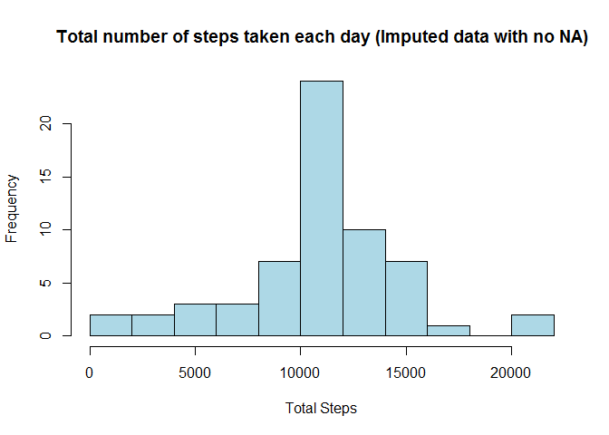

### Prerequisite:  
#### Packages used:

```r
library(dplyr)
```

```
## 
## Attaching package: 'dplyr'
```

```
## The following objects are masked from 'package:stats':
## 
##     filter, lag
```

```
## The following objects are masked from 'package:base':
## 
##     intersect, setdiff, setequal, union
```

```r
library(ggplot2)
```
#### Global option setting:


### Downloading and Reading datasets:


```r
#URL <- "https://d396qusza40orc.cloudfront.net/repdata%2Fdata%2Factivity.zip"
# Downloading and unzipping file:
#download.file(URL, destfile = "data.zip")
#unzip("data.zip")
# Reading of Data into a data frames called
activitydata <- read.csv("activity.csv")
activitydata$date <- as.Date(activitydata$date)
```

## Question-1: What is mean total number of steps taken per day?

For this part of the assignment, the missing values in the dataset are ignored.

#### 1. Calculate the total number of steps taken per day
For proper estimation of mean of the total number of steps taken per day,  
na.rm is made FALSE in order to ignore those days when no data is collected


```r
totalsteps <- with(activitydata, tapply(steps, date, sum, na.rm = FALSE))
```

#### 2. Make a histogram of the total number of steps taken each day

```r
hist(totalsteps, breaks = 10, col = "lightblue", xlab = "Total Steps", 
     main = "Total number of steps taken each day")  
```

<!-- -->
  
#### 3. Calculate and report the mean and median of the total number of steps taken per day  
Mean of the total number of steps taken per day:

```r
mean_withNA <- mean(totalsteps, na.rm = TRUE)
print(mean_withNA)
```

```
## [1] 10766.19
```
Median of the total number of steps taken per day:

```r
median_withNA <- median(totalsteps, na.rm = TRUE)
print(median_withNA)
```

```
## [1] 10765
```

## Question-2: What is the average daily activity pattern?

#### 1. Make a time series plot (i.e. type = "l") of the 5-minute interval (x-axis) and the average number of steps taken, averaged across all days (y-axis)
Preparation od a data frame consisting of intervals and Average number of steps taken, averaged across all days 

```r
stepsperinterval <- aggregate(steps~interval, data=activitydata, mean)
```
Plot of Daily Avg. Steps with Intervals

```r
with(stepsperinterval, 
     plot(interval, steps, type = "l", col="blue", lwd = 2, xlab="Interval", ylab="Daily Avg. Steps",
     main = "Average number of steps taken, averaged across all days"))
```

<!-- -->
  
#### 2. Which 5-minute interval, on average across all the days in the dataset, contains the maximum number of steps?

```r
stepsperinterval[which.max(stepsperinterval$steps),1]
```

```
## [1] 835
```

##  Question-3: Imputing missing values
Note that there are a number of days/intervals where there are missing values (NA). The presence of missing days may introduce bias into some calculations or summaries of the data.

#### 1. Calculate and report the total number of missing values in the dataset (i.e. the total number of rows with (NAs)

```r
sum(is.na(activitydata$steps))
```

```
## [1] 2304
```

#### 2. Devise a strategy for filling in all of the missing values in the dataset. The strategy does not need to be sophisticated. For example, you could use the mean/median for that day, or the mean for that 5-minute interval, etc.
##### Stategy: Use of mean for each 5-minute interval across all days 

#### 3. Create a new dataset that is equal to the original dataset but with the missing data filled in.
A new data set "activity_noNA" is made from the original data set. 
A for loop is run over all rows of the data set such that if any NA is found in the variable "steps",
it will be replaced by the mean value of steps for that interval. 
The mean for each 5-minute interval across all days is already been created as 
the data frame "stepsperinterval" in  Question-2: Part-1

```r
activity_noNA <- activitydata
for (i in seq_along(activity_noNA$steps)) {
  if (is.na(activity_noNA[i,]$steps)) {
    activity_noNA[i,]$steps <- stepsperinterval[which(stepsperinterval[,1]==activity_noNA[i,]$interval),2]
  }
}
```

#### 4. Make a histogram of the total number of steps taken each day and Calculate and report the mean and median total number of steps taken per day. Do these values differ from the estimates from the first part of the assignment? What is the impact of imputing missing data on the estimates of the total daily number of steps?

Histogram of the total number of steps taken each day by the inputated data frame "activity_noNA":

```r
totalsteps_noNA <- with(activity_noNA, tapply(steps, date, sum))
hist(totalsteps_noNA, breaks = 10, col = "lightblue", xlab = "Total Steps", 
     main = "Total number of steps taken each day (Imputed data with no NA)")  
```

<!-- -->
  
Mean of the total number of steps taken per day:

```r
mean_noNA <- mean(totalsteps_noNA)
print(mean_noNA)
```

```
## [1] 10766.19
```
Median of the total number of steps taken per day:

```r
median_noNA <- median(totalsteps_noNA)
print(median_noNA)
```

```
## [1] 10766.19
```
  
Checking the difference between mean and median estimated from original data and imputed data:

```r
percentage_diff_mean <- abs(mean_withNA - mean_noNA)*100/mean_withNA
percentage_diff_median <- abs(median_withNA - median_noNA)*100/median_withNA
```
##### The difference between means estimated from original data and imputed data is 0% whereas the difference between medians is 0.0110421%.

## Question-4: Are there differences in activity patterns between weekdays and weekends?
Use the dataset with the filled-in missing values for this part.  

#### 1. Create a new factor variable in the dataset with two levels – “weekday” and “weekend” indicating whether a given date is a weekday or weekend day.  


```r
activity_noNA$daytype <- 
  if_else(weekdays(activity_noNA$date)=="Saturday" |
            weekdays(activity_noNA$date)=="Sunday",
          "weekend", "weekday")
```

#### 2. Make a panel plot containing a time series plot (i.e. type = "l") of the 5-minute interval (x-axis) and the average number of steps taken, averaged across all weekday days or weekend days (y-axis).

Creation of a data frame grouped by daytype and then by interval:


```r
steps_daytype <-
  activity_noNA %>%
  group_by(daytype, interval)  %>%
  summarise(meansteps = mean(steps))
```

Panel polt by ggplot

```r
ggplot(steps_daytype, aes(interval, meansteps, color = daytype))+geom_line(lwd=1)+
  facet_wrap(daytype~.,ncol=1, nrow = 2)+labs(x="Interval", y="Number of steps")+
  ggtitle("Average number of steps, averaged across all weekday days or weekend days")
```

<!-- -->

